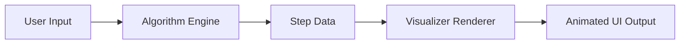

<<<<<<< HEAD
# ⚙️ AlgoPlayground – Algorithm Visualizer

**AlgoPlayground** is an interactive web app that visualizes core algorithms like sorting and pathfinding.  
It’s designed to make abstract algorithmic concepts more intuitive through real-time animations and step-by-step simulation.

---

## 🚀 Live Demo
🔗 [View Project on Netlify](#)  
(Replace the `#` with your deployment link once live.)

---

## 🧠 Project Overview
Algorithms can feel abstract when all you see is code. AlgoPlayground bridges that gap — turning algorithmic logic into a visual story.  
You can **observe how data transforms** with each iteration, comparison, and decision.

### ✨ Features
- **Sorting Visualizer** – Watch algorithms like Bubble Sort, Selection Sort, Merge Sort, and Quick Sort in action.  
- **Pathfinding Visualizer** – Explore how BFS (Breadth-First Search) and DFS (Depth-First Search) traverse graphs.  
- **Adjustable Speed Control** – Slow down or speed up animations to observe each step.  
- **Dynamic Input** – Change array sizes, graph nodes, and start/goal points interactively.  
- **Step Counter & Complexity Display** – Track operations count and view time complexity (O(n²), O(n log n), etc.).

---

## 🧩 Tech Stack
| Layer | Technology |
|:------|:------------|
| Frontend | HTML, CSS, JavaScript |
| (Optional) Framework | React.js |
| Deployment | Netlify / Vercel |

---

## 🧱 Architecture
The project is built around modular logic:
1. **Algorithm Module** – Independent implementations for sorting and traversal algorithms.
2. **Visualizer Engine** – Renders animations frame-by-frame for each algorithm step.
3. **UI Layer** – Interactive controls for user input (array size, speed, algorithm selection).

=======
# AlgoPlayground
>>>>>>> c9505b401a5ec876489a597eac38ebef345285aa
